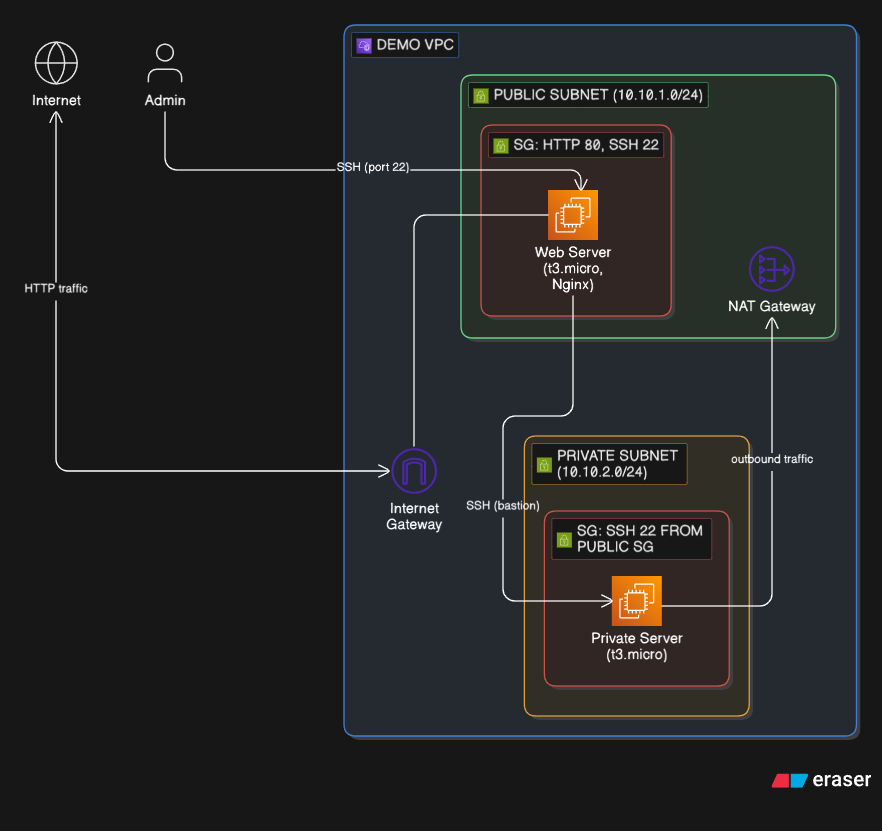
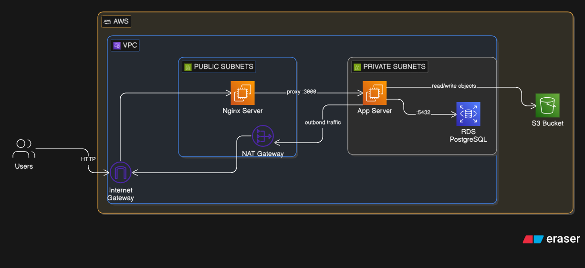
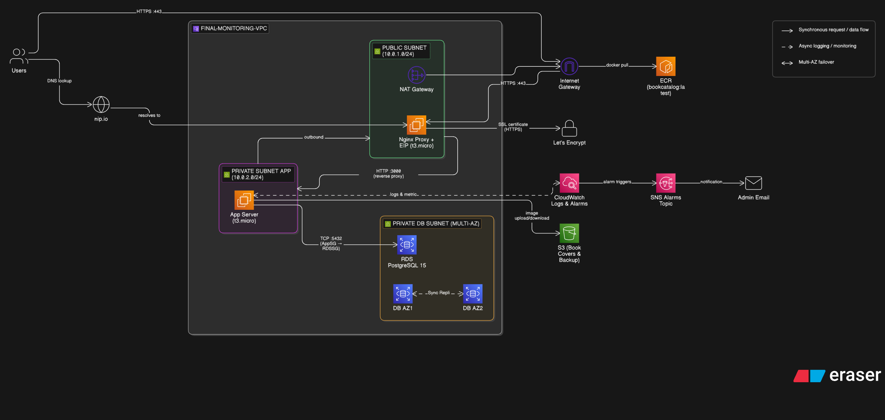

# 🏗️ AWS Infrastructure as Code Portfolio

> Progressive AWS infrastructure deployments using **CloudFormation** and **Terraform** — from a simple VPC to a full production-ready, monitored, multi-AZ architecture.


---

## 📌 Overview

This repository documents a **3-week progressive learning journey** building AWS infrastructure from scratch — each week adding more services, security layers, and production-readiness.

| Week | Title | Key Services |
|------|-------|-------------|
| [Week 1](#week-1--vpc--bastion-host) | VPC & Bastion Host | VPC, EC2, NAT Gateway, IGW |
| [Week 2](#week-2--3-tier-web-application) | 3-Tier Web Application | EC2, RDS PostgreSQL, S3, IAM, Nginx |
| [Week 3](#week-3--production-ready-with-monitoring) | Production-Ready + Monitoring | HTTPS, ECR, CloudWatch, SNS, Multi-AZ RDS |

Each week is implemented in **both CloudFormation and Terraform**.

---

## 📁 Repository Structure

```
aws-iac-portfolio/
│
├── README.md
│
├── diagrams/
│   ├── diagram-week1.png
│   ├── diagram-week2.png
│   └── diagram-week3.png
│
├── cloudformation/
│   ├── week1.yaml
│   ├── week2.yaml
│   └── week3.yaml
│
└── terraform/
    ├── week1/
    │   ├── main.tf
    │   ├── variables.tf
    │   └── outputs.tf
    ├── week2/
    │   ├── main.tf
    │   ├── variables.tf
    │   └── outputs.tf
    └── week3/
        ├── main.tf
        ├── variables.tf
        └── outputs.tf
```

---

## Week 1 — VPC & Bastion Host

> **Goal**: Build a secure VPC with public and private subnets, using a public EC2 as a bastion host to access a private EC2.

### Architecture



### What's Built

- **VPC** — `10.10.0.0/16` with DNS support enabled
- **Public Subnet** — `10.10.1.0/24` with Internet Gateway, hosts Nginx web server
- **Private Subnet** — `10.10.2.0/24`, accessible only via bastion (SSH)
- **NAT Gateway** — allows private EC2 to reach the internet for updates
- **Security Groups** — public EC2 allows HTTP (80) + SSH (22) from specific IP; private EC2 allows SSH only from public SG

### Services Used

`VPC` `EC2 (t3.micro)` `Internet Gateway` `NAT Gateway` `Elastic IP` `Security Groups` `Route Tables`

### Deploy with CloudFormation

```bash
aws cloudformation deploy \
  --template-file cloudformation/week1.yaml \
  --stack-name week1-vpc \
  --parameter-overrides KeyName=your-keypair-name
```

---

## Week 2 — 3-Tier Web Application

> **Goal**: Deploy a full 3-tier architecture: Nginx (reverse proxy) → Node.js App → PostgreSQL RDS, with S3 for file storage.

### Architecture



### What's Built

- **Nginx Server** (Public) — reverse proxy, forwards traffic to App Server on port 3000
- **App Server** (Private) — Node.js app auto-deployed from GitHub via UserData
- **RDS PostgreSQL** (Private, Multi-AZ) — managed database, not publicly accessible
- **S3 Bucket** — stores book cover images with public read policy
- **IAM Role** — EC2 instance profile with S3 read/write + SSM access
- **S3 VPC Endpoint** — private S3 access without traversing the internet
- **Security Groups** — layered: Nginx → App (port 3000) → RDS (port 5432)

### Services Used

`VPC` `EC2` `RDS PostgreSQL` `S3` `IAM Role` `Instance Profile` `NAT Gateway` `VPC Endpoint (S3)`

### Deploy with CloudFormation

```bash
aws cloudformation deploy \
  --template-file cloudformation/week2.yaml \
  --stack-name week2-app \
  --capabilities CAPABILITY_IAM \
  --parameter-overrides \
    KeyName=your-keypair-name \
    DBUsername=postgres \
    DBPassword=yourpassword \
    DBName=bookdb
```

---

## Week 3 — Production-Ready with Monitoring

> **Goal**: Harden the architecture with HTTPS, containerized deployment via ECR, full observability with CloudWatch & SNS alerting.

### Architecture



### What's Built

- **HTTPS (port 443)** — SSL certificate via Let's Encrypt, served through Nginx with EIP
- **ECR (Elastic Container Registry)** — Docker image pulled on EC2 startup
- **nip.io DNS** — free wildcard DNS for HTTPS without a custom domain
- **CloudWatch Logs & Alarms** — app metrics and log collection
- **SNS Topic** — alarm triggers email notification to admin
- **RDS Multi-AZ** — PostgreSQL 15 with synchronous replication across AZ1 & AZ2
- **S3** — stores book cover images + database backups

### Services Used

`VPC` `EC2` `ECR` `RDS PostgreSQL 15 (Multi-AZ)` `S3` `CloudWatch` `SNS` `NAT Gateway` `Let's Encrypt` `Nginx`

### Deploy with CloudFormation

```bash
aws cloudformation deploy \
  --template-file cloudformation/week3.yaml \
  --stack-name week3-production \
  --capabilities CAPABILITY_IAM \
  --parameter-overrides \
    KeyName=your-keypair-name \
    DBPassword=yourpassword
```

---

## 🔁 Terraform Equivalent

Each week's infrastructure is also implemented in Terraform under the `/terraform` directory, allowing direct comparison between the two IaC tools.

```bash
cd terraform/week1
terraform init
terraform plan
terraform apply
```

> ⚠️ **Cost Warning**: Some resources (NAT Gateway, RDS, EIP) incur AWS charges. Remember to destroy after testing:
> ```bash
> terraform destroy
> # or for CloudFormation:
> aws cloudformation delete-stack --stack-name <stack-name>
> ```

---

## 🛠️ Tech Stack

| Category | Tools |
|----------|-------|
| Cloud Provider | AWS |
| IaC | CloudFormation, Terraform |
| Compute | EC2 (t3.micro) |
| Database | RDS PostgreSQL |
| Storage | S3 |
| Networking | VPC, IGW, NAT Gateway, Security Groups |
| Monitoring | CloudWatch, SNS |
| Containers | ECR, Docker |
| SSL | Let's Encrypt |

---

## 👤 Author

**Nizar Rafi Pratama**
[](https://linkedin.com/in/nizarrafipratama)
[](https://github.com/NizarRafiPratama)
